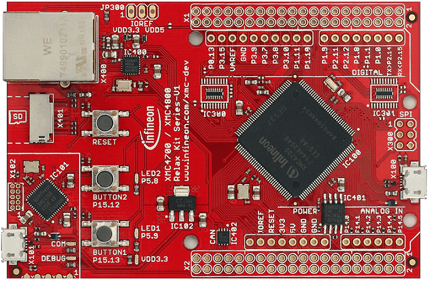

# KIT_XMC47_RELAX_V1 BSP

## Overview

This is Early Access Software for XMC devices in ModusToolbox. This software is made available for evaluation purposes only and is not recommended for production development. 
The XMC4700 Relax Kit is an XMC4700 based microcontroller evaluation kit with Ethernet connection, CAN node and microSD Card slot included. It is hardware compatible with 3.3V Arduino™ Shields.

To use code from the BSP, simply include a reference to `cybsp.h`.

## Features

### Kit Features:

* XMC4700 (ARM Cortex-M4 based) Microcontroller in a LQFP144 package
* On-board Debug Probe with USB interface supporting SWD + SWO
* Detachable J-Link debugger and UART virtual COM port, with micro USB connector
* Virtual COM Port via Debug Probe
* 2 x User Push-Buttons and 2 x User LED and 1 x Reset Push-Button
* Voltage Regulator 5 V -> 3.3 V
* USB (Micro USB Plug)
* 12 MHz Crystal
* 32.768 kHz RTC Crystal
* 0 Ohm Bridges for 3.3 V Arduino shields
* Ethernet PHY and RJ45 Jack
* 32 Mbit Quad-SPI Flash Memory
* microSD Card Slot
* CAN Transceiver

### Kit Contents:

* KIT_XMC47_RELAX_V1 evaluation board

## BSP Configuration

The BSP has a few hooks that allow its behavior to be configured. Some of these items are enabled by default while others must be explicitly enabled. Items enabled by default are specified in the KIT_XMC47_RELAX_V1.mk file. The items that are enabled can be changed by creating a custom BSP or by editing the application makefile.

Components:
    * Device specific category reference (e.g.: CAT1) - This component, enabled by default, pulls in any device specific code for this board.
    * BSP_DESIGN_MODUS - This component, enabled by default, causes the Configurator generated code for this specific BSP to be included. This should not be used at the same time as the CUSTOM_DESIGN_MODUS component.
    * CUSTOM_DESIGN_MODUS - This component, disabled by default, causes the Configurator generated code from the application to be included. This assumes that the application provides configurator generated code. This should not be used at the same time as the BSP_DESIGN_MODUS component.

Defines:
    * CYBSP_WIFI_CAPABLE - This define, disabled by default, causes the BSP to initialize the interface to an onboard wireless chip.
    * CY_USING_HAL - This define, enabled by default, specifies that the HAL is intended to be used by the application. This will cause the BSP to include the applicable header file and to initialize the system level drivers.

### Clock Configuration

| Clock    | Source    | Output Frequency |
|----------|-----------|------------------|

### Power Configuration

## API Reference Manual

The KIT_XMC47_RELAX_V1 Board Support Package provides a set of APIs to configure, initialize and use the board resources.

See the [BSP API Reference Manual][api] for the complete list of the provided interfaces.

## More information
* [KIT_XMC47_RELAX_V1 BSP API Reference Manual][api]
* [KIT_XMC47_RELAX_V1 Documentation](https://www.infineon.com/cms/en/product/evaluation-boards/kit_xmc47_relax_v1/)
* [Cypress Semiconductor, an Infineon Technologies Company](http://www.cypress.com)
* [Cypress Semiconductor GitHub](https://github.com/cypresssemiconductorco)
* [ModusToolbox](https://www.cypress.com/products/modustoolbox-software-environment)

[api]: https://cypresssemiconductorco.github.io/TARGET_KIT_XMC47_RELAX_V1/html/modules.html

---
© Cypress Semiconductor Corporation, 2019-2020.